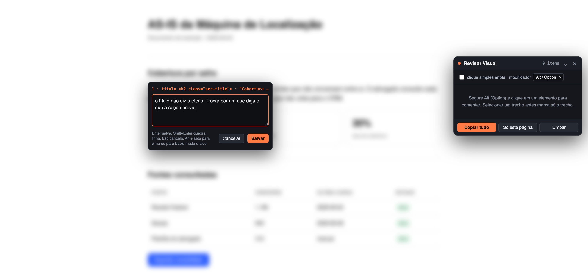
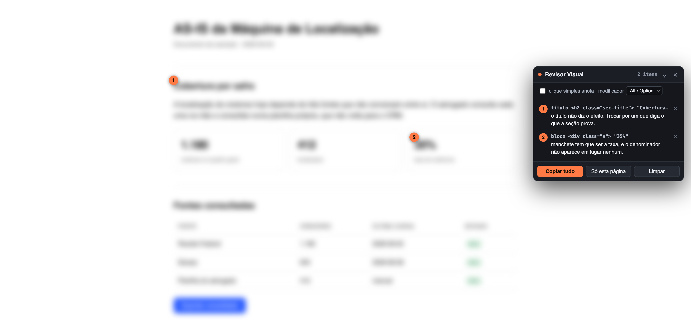

# Revisor Visual

Extensão de navegador para revisar uma página HTML clicando nela, e devolver ao
Claude Code um texto que diz exatamente onde mexer.

Você liga o modo, segura Alt e clica no elemento que está errado. A extensão
reconhece o que você selecionou, desenha o contorno em volta dele e abre uma
caixa para você escrever.



No fim, **Copiar tudo** põe na área de transferência um texto pronto para colar no
Claude. Os marcadores laranjas ficam na página e o painel lista os comentários.



Funciona em arquivo local (`file://`), em `localhost` e em qualquer site. Serve
para HTML estático e para página gerada por React.

## Instalar

Baixe na [página de Releases](../../releases/latest). O passo a passo dos dois
navegadores está na nota da própria versão.

No Firefox é um `.xpi` assinado pela Mozilla, que abre no navegador e instala. No
Chrome é um `.zip` que você descompacta e carrega pelo `chrome://extensions`,
porque a extensão não está na Chrome Web Store.

Para mexer no código, publicar versão nova ou entender os arquivos, veja o
[CONTRIBUTING.md](CONTRIBUTING.md).

## Como usar

| O que você faz | O que acontece |
| --- | --- |
| `Alt+Shift+R`, ou clique no ícone da barra | Liga e desliga o modo de revisão |
| Segurar **Alt** (Option no Mac) | Mostra o contorno do elemento sob o cursor |
| **Alt + clique** | Abre a caixa de comentário naquele elemento |
| Selecionar um trecho e **Alt + clique** | Marca só o trecho, não o parágrafo inteiro |
| **Seta para cima** e **para baixo**, com Alt | Sobe e desce na árvore: do `span` para o cartão inteiro |
| **Enter** na caixa | Salva. `Shift+Enter` quebra linha, `Esc` cancela |
| Clique no número laranja na página | Reabre o comentário para editar |
| **Esc** com o modo ligado | Desliga o modo |

O painel tem uma opção **clique simples anota**, para quando você estiver numa
passada longa e não precisar navegar pela página. O modificador também é
configurável ali, se Alt colidir com alguma coisa.

Os comentários não morrem ao recarregar, ao clicar num link ou ao trocar de
arquivo. A sessão é uma só, a numeração é corrida, e o painel mostra os itens
desta página em cima e os das outras embaixo. Depois que o Claude reescreve o
arquivo e você recarrega, o marcador de um comentário cujo elemento não existe
mais fica cinza, e o item continua na lista.

## O que sai na área de transferência

```
# Revisão visual: 2 itens em 1 página
Gerado em 2026-09-18 14:09.

Cada item traz uma âncora, que é o texto como ele aparece na página e, em geral,
literalmente no arquivo fonte, mais um caminho CSS que confirma o alvo. Ache o
trecho pela âncora, confirme pelo caminho e aplique o pedido. Não altere nada
fora do que está listado.

## Página 1: AS-IS da Máquina de Localização
Arquivo: /Users/reasset/Documents/.../1 - AS-IS/AS-IS.html

### 1 · título <h2 class="sec-title"> em section#diagnostico
Âncora: "Cobertura por safra"
Caminho: section#diagnostico > h2.sec-title
Atenção: esse texto aparece 2 vezes na página. Desempate pelo caminho.
Pedido: o título não diz o efeito. Trocar por um que diga o que a seção prova.
```

Três decisões de formato, que são o motivo de o texto funcionar:

- **A âncora vem primeiro**, porque é o que o Claude sabe procurar. Seletor CSS de
  página React (`css-1x9f3k7`) não existe no código fonte, então sozinho não serve
  de endereço. Texto literal serve.
- **O caminho desempata, não endereça.** A extensão sobe a árvore até o caminho
  identificar o elemento sozinho, e confere contra a página antes de exportar.
  Texto repetido ganha a linha de "Atenção".
- **Elemento sem texto ganha ponto de referência.** Ícone e imagem sem `alt` não
  têm âncora, então entra o rótulo curto mais próximo, dizendo qual dos dois é.

O arquivo aparece como caminho absoluto no disco quando a página é `file://`. Em
`localhost` sai a URL, porque não dá para saber o arquivo que gerou a página.

## Limites conhecidos

- **Não abre o arquivo nem edita nada.** Ela só descreve. Quem mexe é o Claude.
- **Não faz captura de tela.** Imagem custa muito token e, na prática, a âncora
  mais o caminho já bastam.
- **Em React de produção não há mapeamento para linha do fonte.** O `_debugSource`
  do React só existe em build de desenvolvimento, e lê-lo exigiria rodar script no
  mesmo mundo de JavaScript da página, o que o Chrome permite e o Firefox ainda
  não.
- **Não roda dentro de `iframe`.** `all_frames` está desligado de propósito, para
  não duplicar painel.
- **Não roda em página interna do navegador** (`chrome://`, `about:`), nem na loja
  de extensões. É restrição do navegador, não da extensão.

Escrito em 2026-09-18, contra Chrome no Manifest V3 e Firefox 115 ou mais novo.
