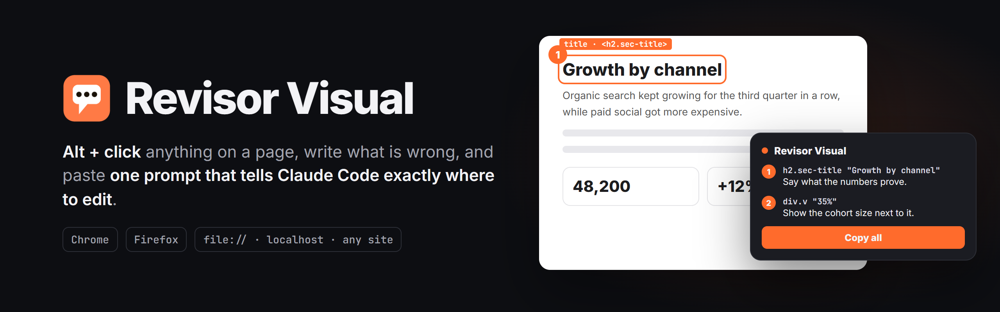
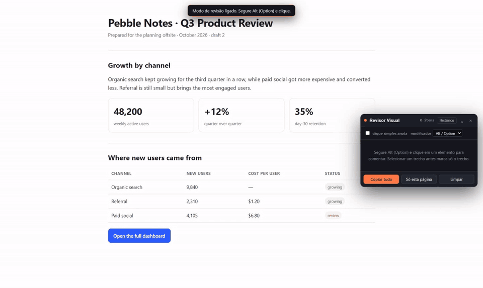
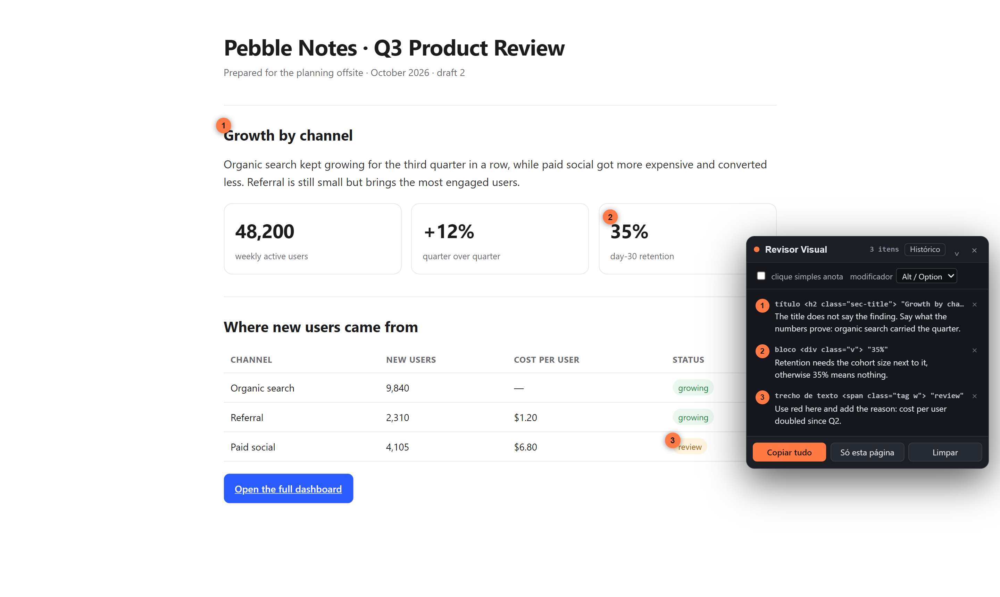

<div align="center">

<picture>
  <source media="(prefers-color-scheme: dark)" srcset=".github/assets/banner-dark.png">
  <source media="(prefers-color-scheme: light)" srcset=".github/assets/banner-light.png">
  
</picture>

<br>


<br><br>

**A browser extension to review an HTML page by clicking on it,**<br>
**and hand Claude Code a text that says exactly where to change things.**

[Install](#install) · [How to use](#how-to-use) · [What goes to the clipboard](#what-goes-to-the-clipboard) · [Known limits](#known-limits)

<br>



</div>

<br>

Turn review mode on, hold **Alt** and click the element that is wrong. The extension
figures out what you picked, outlines it and opens a box for you to write. At the end,
**Copy all** puts a ready-to-paste prompt for Claude on the clipboard. The orange markers
stay on the page and the panel lists every comment.



It works on local files (`file://`), on `localhost`, on any site and inside Claude
Artifacts, for static HTML and for React-generated pages alike.

> [!NOTE]
> The extension's interface is in Brazilian Portuguese. The page in the screenshots is a
> made-up report.

## Install

Download it from the [Releases page](../../releases/latest). Each release note has the
step-by-step for both browsers.

- **Firefox:** a `.xpi` signed by Mozilla. Open it in the browser and it installs.
- **Chrome:** a `.zip` you unzip and load from `chrome://extensions`, since the extension
  is not on the Chrome Web Store.

To work on the code, publish a new version or understand the files, see
[CONTRIBUTING.md](CONTRIBUTING.md).

## How to use

| What you do                                         | What happens                                                        |
| --------------------------------------------------- | ------------------------------------------------------------------- |
| `Alt+Shift+R`, or the toolbar icon                  | Turns review mode on and off                                        |
| Hold **Alt** (Option on Mac)                        | Outlines the element under the cursor                               |
| **Alt + click**                                     | Opens the comment box on that element                               |
| Select some text, then **Alt + click**              | Marks only that passage, not the whole paragraph                    |
| **Arrow up** / **down**, with Alt                   | Walks up and down the tree: from a `span` to the whole card         |
| **Enter** in the box                                | Saves. `Shift+Enter` adds a line, `Esc` cancels                     |
| Click an orange number on the page                  | Reopens that comment to edit it                                     |
| **Esc** with review mode on                         | Turns review mode off                                               |
| **Clear**, twice                                    | Saves the session to history and empties the panel                  |
| **History**, at the top of the panel                | Swaps the panel list for past sessions, to check them item by item  |

The panel has a **single click annotates** option for long passes where you do not need to
navigate the page, and the modifier key is configurable there if Alt clashes with
something.

Comments survive reloads, links and switching files. There is one session with continuous
numbering, and the panel shows this page's items first and the other pages' below. After
Claude rewrites the file and you reload, a comment whose element no longer exists turns
gray and stays on the list.

## History and checking

History keeps every session with a snapshot of each item, so you can check afterwards,
item by item, whether Claude applied the request. A session is whatever is in the panel
between one **Clear** and the next. It is saved when you copy, when you clear and when you
turn review mode off; the open session shows up in history too.

Each session has a progress bar of checked items, and each item has **✓** for done and
**✗** for not done. Clicking an item on this page scrolls to it; clicking an item on
another page takes the tab there. The element is highlighted, and a card in the bottom
left shows the request and the snapshot from before. If the element is gone, or there is
different text in the same place now, the card says so.

**Full page** opens history in its own tab with large snapshots. **Copy the ones not done**
builds the prompt again with only the items marked as not done. **Import export** reads a
prompt you already pasted into Claude and creates one session per copy, without snapshots.
Importing the same copy twice does not duplicate anything.

History and snapshots stay in this browser, in the extension's storage, and never leave it.

## What goes to the clipboard

```
# Revisão visual: 2 itens em 1 página
Gerado em 2026-10-06 14:09.

Cada item traz uma âncora, que é o texto como ele aparece na página e, em geral,
literalmente no arquivo fonte, mais um caminho CSS que confirma o alvo. Ache o
trecho pela âncora, confirme pelo caminho e aplique o pedido. Não altere nada
fora do que está listado.

## Página 1: Pebble Notes · Q3 Product Review
Arquivo: /Users/you/Documents/reports/q3-review.html

### 1 · título <h2 class="sec-title"> em section#growth
Âncora: "Growth by channel"
Caminho: section#growth > h2.sec-title
Pedido: The title does not say the finding. Say what the numbers prove.
```

Three format decisions are why the prompt works:

- **The anchor comes first**, because it is what Claude knows how to search for. A CSS
  class from a React build (`css-1x9f3k7`) does not exist in the source, so on its own it
  is not an address. Literal text is.
- **The path breaks ties, it does not address.** The extension walks up the tree until
  the path identifies the element on its own, and checks it against the page before
  exporting. Repeated text gets an `Atenção` (watch out) line.
- **Elements without text get a landmark.** Icons and images without `alt` have no
  anchor, so the nearest short label goes in, saying which one it is.

The file shows up as an absolute path on disk for `file://` pages. On `localhost` it is the
URL, since there is no way to know which file produced the page.

## Known limits

- **It does not open or edit any file.** It only describes. Claude does the editing.
- **The prompt carries no images.** Images cost a lot of tokens and, in practice, anchor
  plus path is enough. Snapshots are for history only.
- **Snapshots come from the visible part of the tab.** An element taller than the screen
  gets cut, and the panel shows up if it is on top of the element.
- **No source-line mapping in production React.** React's `_debugSource` only exists in
  development builds, and reading it would require running in the page's own JavaScript
  world, which Chrome allows and Firefox does not yet.
- **One frame per tab.** When an `iframe` covers half the window or more, as in a Claude
  Artifact, the review happens inside it. A smaller `iframe`, like a video in an article,
  is left out.
- **It does not run on internal browser pages** (`chrome://`, `about:`) or extension
  stores. That is a browser restriction.

Tested against Chrome on Manifest V3 and Firefox 115 or newer.

## License

[MIT](LICENSE)

<br>

<div align="center">
<sub>Built by <a href="https://github.com/megomes">Matheus Ervilha</a> to review the pages Claude writes without describing them in words.</sub>
</div>
